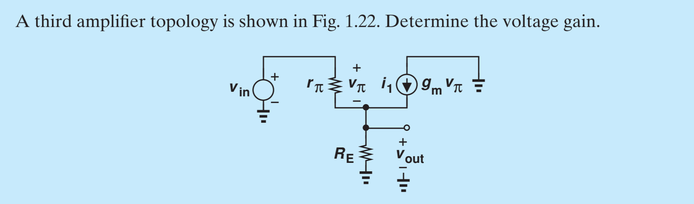
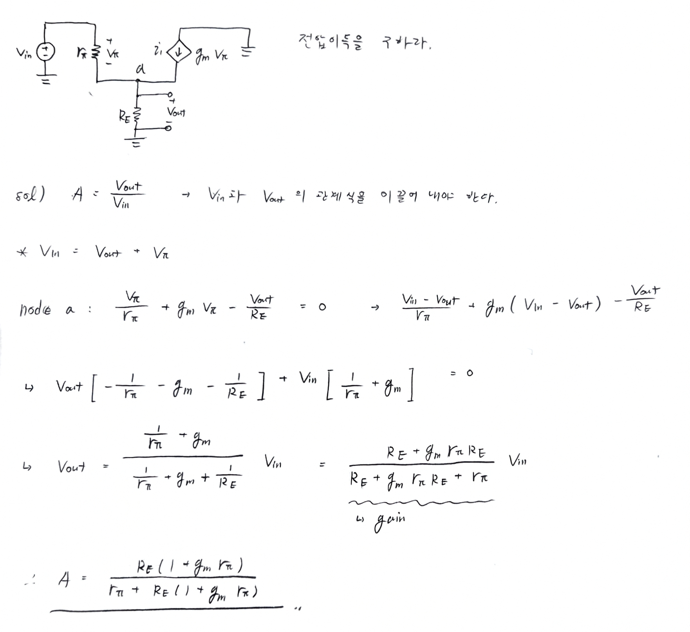

## - Problem

위 문제는 Behzad Razavi의 Fundamentals of Microelectronics 의 예제 1.7번 문제이다. 
전자회로라는 과목을 제대로 들어가기 전에 복습하는 챕터이다. 문제를 풀어보자.

---

## Solution

Dorf 회로이론 책에서는 항상 폐회로로 표현이 되어있었는데, Razavi 전자회로 책에서는 저런식으로 간략화된 회로도 표현법을 사용한다. 

## Exercise

### $r_{\pi} \to \infin$ 일 때 전압이득을 다시 구하라.

$$
\lim_{r_\pi \to \infty} = \dots
$$